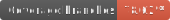
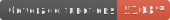
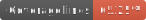
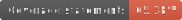

# Premier League Fav Toggler

[](https://dl.circleci.com/status-badge/redirect/gh/ShotaroMatsuya/premier-league-fav-toggler/tree/master) [](https://snyk.io/test/github/ShotaroMatsuya/premier-league-fav-toggler)  [](https://cloud.cypress.io/projects/khdjk9/runs) [![renovate-app badge][renovate-badge]][renovate-app]

   

[](https://app.circleci.com/insights/github/ShotaroMatsuya/premier-league-fav-toggler/workflows/build-and-deploy/overview?branch=master&reporting-window=last-90-days&insights-snapshot=true)  

> You can check the latest stats of your favorite player for this season from the player list of the Premier League. Furthermore, the functionality has been expanded to include access to the &#34;Premier League standings&#34; and &#34;Premier League one-week match schedule,&#34; which are always kept up-to-date.

### ✨ [Demo](https://premier-league-fav-toggler.web.app/)

## Install

```sh
npm install
```

## Usage

```sh
npm run start
```

## Run tests

```sh
npm run test
```

## Renew snapshots for visual regression test

```sh
docker compose run cypress run --env type=base
```


## Author

👤 **ShotaroMatsuya**


## Show your support

Give a ⭐️ if this project helped you!


***
_This README was generated with ❤️ by [readme-md-generator](https://github.com/kefranabg/readme-md-generator)_

[renovate-badge]: https://img.shields.io/badge/renovate-app-blue.svg
[renovate-app]: https://renovateapp.com/
